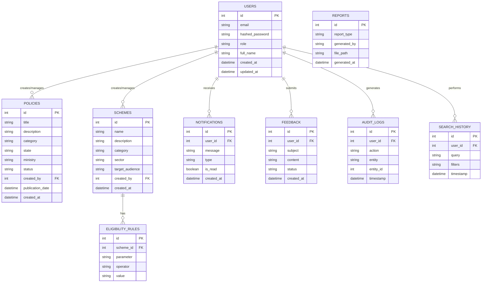

# Database Schema

```mermaid
erDiagram
    USERS ||--o{ POLICIES : "creates/manages"
    USERS ||--o{ SCHEMES : "creates/manages"
    USERS ||--o{ NOTIFICATIONS : "receives"
    USERS ||--o{ FEEDBACK : "submits"
    USERS ||--o{ AUDIT_LOGS : "generates"
    USERS ||--o{ SEARCH_HISTORY : "performs"
    
    SCHEMES ||--o{ ELIGIBILITY_RULES : "has"

    USERS {
        int id PK
        string email
        string hashed_password
        string role
        string full_name
        datetime created_at
        datetime updated_at
    }

    POLICIES {
        int id PK
        string title
        string description
        string category
        string state
        string ministry
        string status
        int created_by FK
        datetime publication_date
        datetime created_at
    }

    SCHEMES {
        int id PK
        string name
        string description
        string category
        string sector
        string target_audience
        int created_by FK
        datetime created_at
    }

    ELIGIBILITY_RULES {
        int id PK
        int scheme_id FK
        string parameter
        string operator
        string value
    }

    NOTIFICATIONS {
        int id PK
        int user_id FK
        string message
        string type
        boolean is_read
        datetime created_at
    }

    FEEDBACK {
        int id PK
        int user_id FK
        string subject
        string content
        string status
        datetime created_at
    }

    REPORTS {
        int id PK
        string report_type
        string generated_by
        string file_path
        datetime generated_at
    }

    AUDIT_LOGS {
        int id PK
        int user_id FK
        string action
        string entity
        int entity_id
        datetime timestamp
    }

    SEARCH_HISTORY {
        int id PK
        int user_id FK
        string query
        string filters
        datetime timestamp
    }
```
