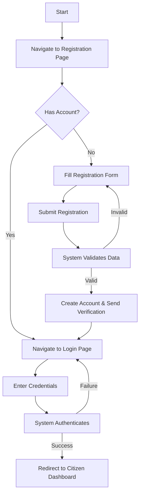
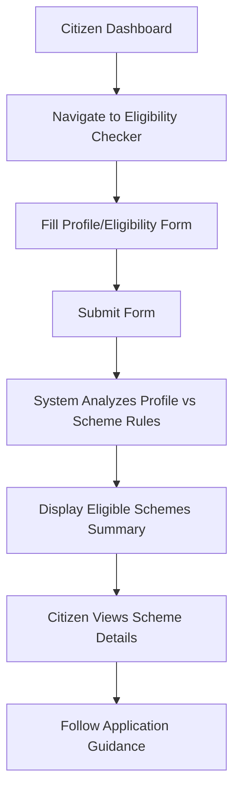
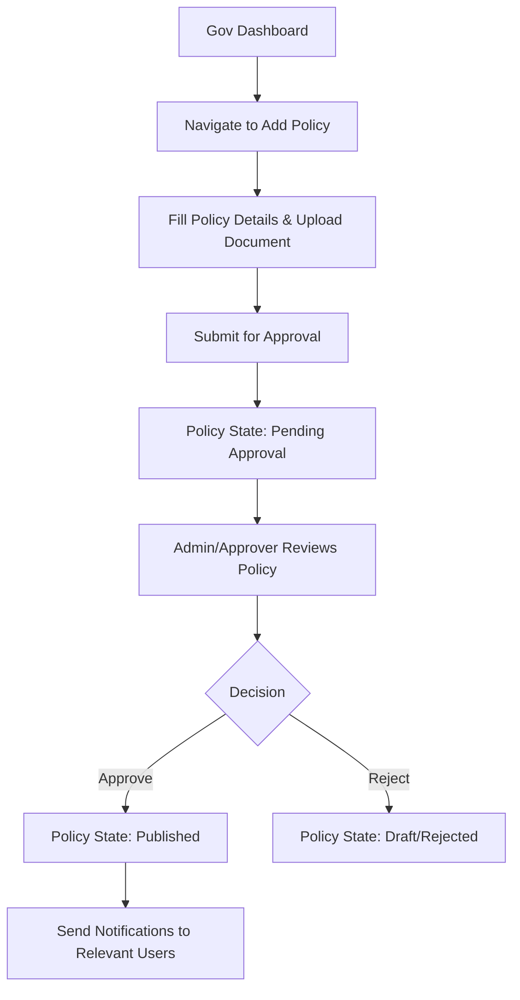

# User Flows

## Citizen Registration & Login Flow

```mermaid
graph TD
    A[Start] --> B[Navigate to Registration Page]
    B --> C{Has Account?}
    C -- Yes --> D[Navigate to Login Page]
    C -- No --> E[Fill Registration Form]
    E --> F[Submit Registration]
    F --> G[System Validates Data]
    G -- Invalid --> E
    G -- Valid --> H[Create Account & Send Verification]
    H --> D
    D --> I[Enter Credentials]
    I --> J[System Authenticates]
    J -- Success --> K[Redirect to Citizen Dashboard]
    J -- Failure --> D
```

## Eligibility Check Flow

```mermaid
graph TD
    A[Citizen Dashboard] --> B[Navigate to Eligibility Checker]
    B --> C[Fill Profile/Eligibility Form]
    C --> D[Submit Form]
    D --> E[System Analyzes Profile vs Scheme Rules]
    E --> F[Display Eligible Schemes Summary]
    F --> G[Citizen Views Scheme Details]
    G --> H[Follow Application Guidance]
```

## Policy Creation & Approval Flow (Government Official)

```mermaid
graph TD
    A[Gov Dashboard] --> B[Navigate to Add Policy]
    B --> C[Fill Policy Details & Upload Document]
    C --> D[Submit for Approval]
    D --> E[Policy State: Pending Approval]
    E --> F[Admin/Approver Reviews Policy]
    F --> G{Decision}
    G -- Approve --> H[Policy State: Published]
    G -- Reject --> I[Policy State: Draft/Rejected]
    H --> J[Send Notifications to Relevant Users]
```
